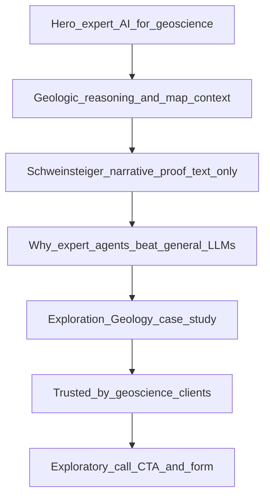
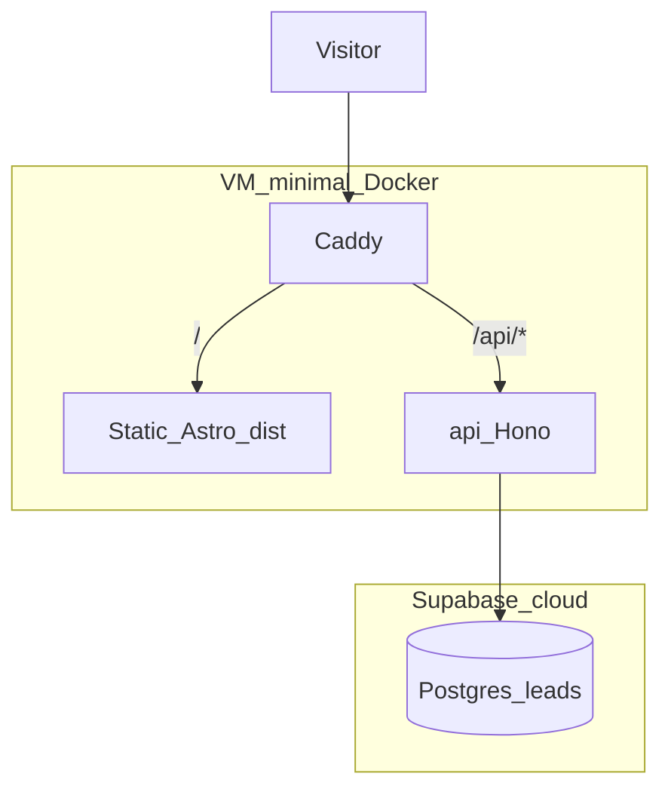
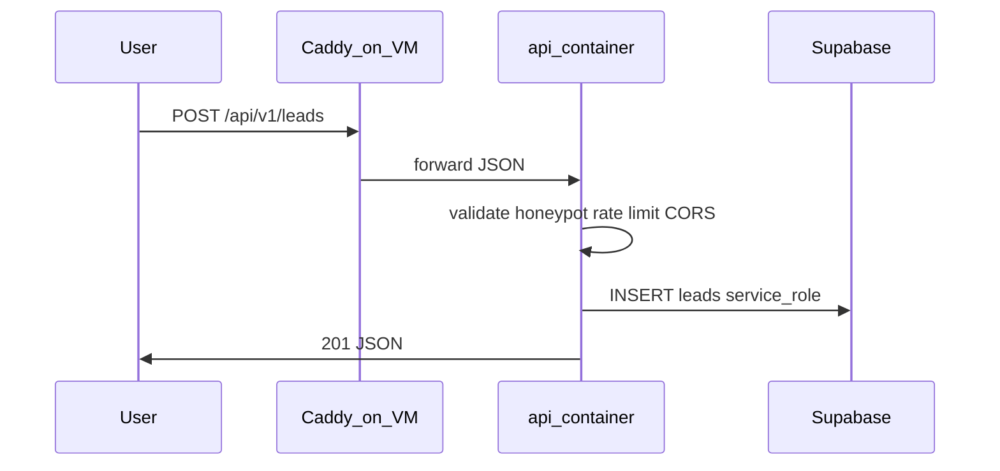
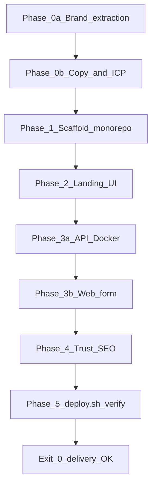

<!-- 72664bbf-36f8-45b9-ac3b-feee4c0d3b1d -->
---
todos:
  - id: "write-plan-md"
    content: "Create plan.md at repo root with full spec (scope, goals, principles, guidelines, rules, tasks)"
    status: pending
  - id: "phase-0-brand"
    content: "Phase 0a (early): Extract brand assets from fabriqai.com → tokens.css, public/brand/, BRAND.md"
    status: pending
  - id: "phase-0-discovery"
    content: "Phase 0b: Geoscience copy, Schweinsteiger text proof (no screenshots), CTA, case study"
    status: pending
  - id: "phase-1-scaffold"
    content: "Scaffold Astro + TS, README, .env.example, BaseLayout, content.ts"
    status: pending
  - id: "phase-2-ui"
    content: "Build landing sections + responsive layout + a11y pass"
    status: pending
  - id: "phase-3-api-docker"
    content: "Docker API (Hono) + Supabase leads + POST /v1/leads"
    status: pending
  - id: "phase-3-web-form"
    content: "Astro lead form → API URL, CORS, env PUBLIC_API_URL, form UX"
    status: pending
  - id: "deploy-script"
    content: "scripts/deploy.sh — build, compose up, Let's Encrypt via Caddy, --verify acceptance checks"
    status: pending
  - id: "phase-4-5-ship"
    content: "Privacy/SEO, run deploy.sh on VM, backups, analytics; delivery = verify exits 0"
    status: pending
isProject: false
---
# Fabriq landing page — plan.md

## Deliverable

After you approve this plan, implementation mode will add **[plan.md](plan.md)** at the repo root (`/home/pele/proj/fabriq-landing-page/plan.md`). That file is the living spec: scope, goals, principles, guidelines, rules, architecture, phases, and task checklist.

---

## Vision

A fast, credible, single-purpose marketing site for **Fabriq** whose primary job is **convert visitors into sales leads** (not educate, not host a blog, not ship a product app).

---

## Goals

| Priority | Goal | How we measure |
|----------|------|----------------|
| P0 | Maximize qualified lead submissions | Conversion rate (form submits / unique sessions) |
| P0 | Low friction capture | Form ≤ 4–5 fields; one primary CTA above the fold |
| P1 | Trust & clarity | Bounce rate, time on page, scroll to form |
| P1 | Performance & SEO | Lighthouse ≥ 90 (perf/a11y/SEO); indexable pages |
| P2 | Operability | Leads stored reliably; team notified within minutes |

**Non-goals (v1):** authenticated app, blog/CMS, pricing calculator, multi-language, A/B framework.

---

## Scope

### In scope (v1)

- Single geoscience-focused landing page (long-scroll)
- Sections: hero, expertise value prop, **General LLM vs expert agent proof** (Schweinsteiger demo), why Fabriq wins, geology case-study proof, trusted-by logos, CTA + lead form
- Lead form → **owned API** (validate, persist, notify)
- Basic analytics hook (e.g. Plausible/GA4 — env-configured)
- Responsive layout (mobile-first)
- Legal minimum: privacy note + consent checkbox if storing PII
- Deploy: Astro static + **light Docker stack on VM** (API + Caddy only) + **Supabase** (hosted Postgres)

### Out of scope (v1)

- CRM native sync (HubSpot/Salesforce) — defer to webhook phase
- Marketing automation drips
- Customer login / dashboard
- Custom CMS; all copy in repo until v2

### Assumptions (document in plan.md; revise when known)

- **Brand source of truth:** [fabriqai.com](https://www.fabriqai.com/) (Wix site) — palette, typography, logos, and messaging are deduced there and ported into the repo (see **Brand system** below)
- **Visual brand** from [fabriqai.com](https://www.fabriqai.com/); **page narrative** is a **Geoscience vertical** campaign (expert AI agents, geologic reasoning, map/regulatory context) — not a generic clone of the corp. homepage hero
- Some fabriqai.com subpages (`/about`, `/technology`, `/home`) contain **stale Wix template content** (Volaso robotics) — **ignore**; reuse corp. **Exploration Geology** case study + geoscience-related client logos where licensed

---

## Page narrative (Geoscience landing)

**Page flow (scroll order):**



| # | Section | Purpose |
|---|---------|---------|
| 1 | Hero | Establish **expert AI agents for Geoscience** — reasoning + geographic/regulatory context |
| 2 | Value | Regulatory + geographical + complex geological context → relevant information **on a map** |
| 3 | **Proof** | Story format: football ChatGPT/Copilot quote vs condensed Fabriq geoscience answer (text only) |
| 4 | Why Fabriq | Domain ontologies, explainability, SME control (short; ties to corp. philosophy) |
| 5 | Case study | Corp. Exploration Geology proof (time saved, citations, map-ready) |
| 6 | Logos | GeoScienceWorld, NOD, etc. |
| 7 | CTA + form | Exploratory call sign-up (long-form CTA paragraph + short button) |

**Lead form intent:** `lead_type = exploratory_call` (optional DB column or tag in `message` / `utm_campaign` default `geoscience`).

---

## Principles

1. **One page, one action** — Every section supports “request demo / get in touch”; no competing nav destinations.
2. **Speed is conversion** — Minimal client JS; prioritize LCP and stable layout.
3. **Trust before ask** — Show who it’s for, what they get, and proof before the form.
4. **Own the lead pipe** — Form posts to **your Docker API on your VM**; leads stored in **your Supabase project** (server-side writes only); no third-party form iframe.
5. **Ship thin, measure, iterate** — v1 is copy + form + deploy; optimize from real funnel data.
6. **Accessible by default** — Keyboard, labels, contrast, and error messages are not optional.

---

## Guidelines

### Copy & messaging (Geoscience campaign — primary narrative)

**Audience:** Exploration geologists, geoscience teams, energy/mining operators, regulators-facing technical staff.

**Core message:** Fabriq builds **expert AI agents for Geoscience** that perform **geologic reasoning** and place answers in **geographic and regulatory context** (maps, jurisdictions, licence blocks) — not generic chat.

**Hero (draft — refine in Phase 0b):**

- **H1:** Expert AI agents for geoscience — reasoning you can map
- **Sub:** Geologic interpretation, regulatory boundaries, and geographic context in one explainable workflow

**Proof section (required — centerpiece): “Schweinsteiger” ambiguity**

| Element | Spec |
|---------|------|
| Prompt shown on page | `What was the goal of Schweinsteiger?` |
| **No screenshots** | Text-only demo — no ChatGPT/Copilot UI images, no live API calls |
| General LLM copy | **Same quote** for ChatGPT and Copilot (approved verbatim below) |
| Fabriq copy | Full answer in `content.ts`; **condensed** inline in the story sentence |
| Section headline | General models aren’t built for expertise work |
| Takeaway | General LLMs optimize for broad priors; **domain-grounded agents** use licence blocks, wells, and basin context |

**Narrative pattern (primary UX — dense story, not three wide columns):**

1. Display the prompt.
2. Lead line: *You will most likely get a football-related answer from ChatGPT or Copilot…*
3. Blockquote — **general LLM** (ChatGPT / Copilot).
4. Bridge: *…while you were probably looking for something like:*
5. Highlighted **condensed Fabriq** answer (1–2 sentences).
6. Optional `<details>` or secondary block: **full Fabriq answer** for readers who want detail.

**Approved copy (`apps/web/src/content.ts`):**

```ts
proof: {
  prompt: "What was the goal of Schweinsteiger?",
  narrativeLead:
    "You will most likely get a football-related answer from ChatGPT or Copilot…",
  generalLlm: {
    label: "ChatGPT / Copilot",
    quote:
      "It seems like you're referring to Bastian Schweinsteiger, a former German professional footballer who played as a midfielder. During his career, Schweinsteiger scored many goals, so it's hard to pinpoint one specific goal.",
  },
  bridge: "…while you were probably looking for something like:",
  fabriqCondensed:
    "The goal of the Schweinsteiger prospect (licence PL829) was a commercial hydrocarbon discovery in the Åsgard Fm, tested by well 6204/11-3 in September 2020—the well was dry and the licence was relinquished.",
  fabriqFull:
    "The goal of the Schweinsteiger prospect, which is associated with license PL829, was to find a commercial discovery of hydrocarbons. The prospect was believed to have a main reservoir of Åsgard Fm and was tested by drilling well 6204/11-3 in September 2020. However, the well turned out to be dry, and as a result, the license was relinquished.",
}
```

**Implementation:** `ExpertiseProof.astro` — single-column story layout; typography distinguishes quote vs Fabriq highlight; map/regulatory mention in surrounding copy, not a live map v1.

**Primary CTA (user-approved — use verbatim in `content.ts`, light copy-edit only for typos):**

> If you'd like to be able to know how to accurately handle regulatory, geographical, and complex geological context in order to find relevant information and show it on a map, then sign up for an exploratory call with us.

- **Button label:** Sign up for an exploratory call
- **Form section title:** Book an exploratory call
- **Form fields:** work email, name, company, role (e.g. geoscientist / GIS / manager), optional message
- All strings in `apps/web/src/content.ts` under `campaign.geoscience`

**SEO title (draft):** `Fabriq | Expert AI agents for geoscience`
**Meta description (draft):** Domain-grounded geologic reasoning with regulatory and map context — not generic chat.

### Design (aligned with fabriqai.com)

- Use **deduced brand tokens** in `src/styles/tokens.css` (see Brand system) — do not invent a new palette.
- Typography: **Poppins** (headings/UI) + **Wix Madefor Text** or system sans for body (match corporate site).
- Light lavender sections (`#E2DBF7`) with deep purple text (`#201240`); violet CTAs (`#704CD9` / `#5919C1`).
- Reuse **client logo strip** — **prioritize geoscience logos** (GeoScienceWorld, Norwegian Offshore Directorate, exploration-geology case study partners) from corp. site where licensed.
- Hero/visuals: map/geology motif or corp. **Exploration Geology** imagery over generic football/stock photos; Fabriq-grafikk optional.
- Proof section: narrative + blockquotes only (**no screenshots**); label clearly as illustrative general-LLM response, not a live integration.
- Generous whitespace; mobile-first; form reachable within 1–2 scrolls on desktop.

### SEO & sharing

- Unique `<title>`, meta description, Open Graph/Twitter tags.
- `robots.txt`, `sitemap.xml` (single URL).
- Semantic headings (`h1` once), structured data optional (Organization).

### Performance

- Target: LCP &lt; 2.5s on 4G; no heavy animation libraries on v1.
- Optimize images (WebP/AVIF, explicit dimensions).
- Defer non-critical scripts (analytics).

---

## Rules

### Engineering

- TypeScript throughout; strict mode on.
- No secrets in repo; use `.env.example` for `SUPABASE_*`, etc.
- API validates input server-side; rate-limit or honeypot on public form endpoint.
- Store leads with timestamp + source UTM fields when present.
- Log errors server-side; never expose stack traces to clients.

### Content & legal

- Privacy policy link (can be `/privacy` stub v1) before collecting email.
- Explicit consent for contact if required by your jurisdiction (checkbox copy TBD).
- Do not claim customers/logos you do not have; use “Trusted by teams like…” only with permission.

### Process

- **plan.md** is updated when scope changes; tasks checked off in the same file or linked issue list.
- Commits only when you ask; no force-push to main.

---

## Brand system (deduced from fabriqai.com)

Analysis date: 2026-06-02. Source: homepage HTML/CSS + Wix theme variables on [fabriqai.com](https://www.fabriqai.com/).

### Positioning & voice

| Element | Corporate site content |
|---------|------------------------|
| Browser title | Fabriq \| explainable ai |
| Hero H1 | GenAI as Infrastructure for Growing Businesses |
| Hero sub | Everybody knows AI will impact their business. Few know where to start. We help with AI inside your tools and workflows — from first steps to steady state. |
| Core themes | Explainable AI, domain experts in control, model-agnostic, workflow embedding, enterprise trust |
| Footer voice | © … **woven by Fabriq** (weave/fabric metaphor — optional micro-copy on landing) |
| Primary CTA (corp.) | Contact form: First name, Last name, Email, Message — **SEND MESSAGE >** |

**Landing-page adaptation:** Corp. site supplies **brand + geology proof** (Exploration Geology block: “Research time cut from days to minutes”, map-ready citations). **Hero and body copy** follow the **Geoscience campaign** section above, not the generic “GenAI as Infrastructure for Growing Businesses” H1.

### Color palette (Wix theme → design tokens)

| Token | Hex | Role on corp. site |
|-------|-----|-------------------|
| `--color-text-primary` | `#201240` | Headings, primary text (rgb 32,18,64) |
| `--color-text-secondary` | `#38266d` | Subtitles, secondary headings |
| `--color-bg-primary` | `#E2DBF7` | Section backgrounds (lavender mist) |
| `--color-bg-secondary` | `#A994E8` | Cards / shaded panels |
| `--color-accent` | `#704CD9` | Links, highlights, UI accent |
| `--color-accent-strong` | `#5919C1` | Buttons / emphasis (inline styles) |
| `--color-accent-hot` | `#ED1566` | Sparingly — gradient/spot highlights |
| `--color-highlight` | `#FAE34D` | Optional callout yellow |
| `--color-surface` | `#FFFFFF` | White content areas |
| `--color-muted` | `#7E7973` | Body grey, Wix “action” slot |

```css
/* Proposed src/styles/tokens.css — map from Wix */
:root {
  --fabriq-purple-900: #201240;
  --fabriq-purple-700: #38266d;
  --fabriq-purple-500: #704cd9;
  --fabriq-purple-600: #5919c1;
  --fabriq-lavender-100: #e2dbf7;
  --fabriq-lavender-200: #a994e8;
  --fabriq-magenta: #ed1566;
  --fabriq-yellow: #fae34d;
  --fabriq-white: #ffffff;
  --fabriq-grey: #7e7973;
}
```

### Typography

| Use | Family | Notes |
|-----|--------|-------|
| Headings | **Poppins** (400/700, semibold variant) | Loaded via Google Fonts in Wix |
| Body / UI | **Wix Madefor Text** (`wix-madefor-text-v2`) or **DM Sans** fallback | Close open-source stand-in if Madefor unavailable |
| System fallback | Helvetica, Arial, sans-serif | Wix default stack |

### Imagery & assets to extract (early)

| Asset | Wix media ID / name | Use on landing |
|-------|---------------------|----------------|
| Brand illustration | `Fabriq-grafikk-1-mask-lr.png` | Hero / section divider |
| Client logos | Atlas Meditech, Cato, GeoScienceWorld, Norwegian Offshore Directorate, Stead Impact, TapRoot, etc. | “Trusted by” strip |
| Favicon / mark | `03f1b4_…svg` (blocked hotlink — re-export from Wix editor or brand folder) | `public/favicon.svg` |
| Case study photos | Unsplash (`nsplsh_*`) on corp. site | Optional — prefer 1 cropped hero image max on landing |

**Extraction rule:** Download from Wix CDN during Phase 0a, commit to `public/brand/` with descriptive names; document original URL in `BRAND.md`. Confirm usage rights with Fabriq team before production.

### Visual patterns (replicate, simplify)

- Alternating **lavender band** sections with white content blocks
- Large **Poppins** headlines in `#201240`, muted subcopy in `#38266d`
- Horizontal **logo marquee** under “Trusted by”
- Proof blocks: **Schweinsteiger comparison** + 1–2 Exploration Geology metrics from corp. site (days → minutes, cited answers)
- Minimal nav: logo + single CTA (corp. site is long-scroll; landing can drop deep nav)

### Pages to ignore

- `/about`, `/technology`, `/home` — Volaso robotics template leftovers; do not source copy or visuals from these.

---

## Recommended stack

**Monorepo: static landing (Astro) + Dockerized API on a dedicated VM**

| Layer | Choice | Rationale |
|-------|--------|-----------|
| Site | **Astro 5 SSG** (`apps/web`) | Fast pages; no server runtime on CDN/VM static host |
| API | **Node 20 + Hono** (`services/api`) | Small Docker image, TypeScript, simple `POST /v1/leads` |
| Database | **Supabase** (hosted Postgres, free tier) | **No DB container on VM** — smallest feasible machine |
| Orchestration | **Docker Compose** on VM | **`api` + `caddy` only** (2 services) |
| TLS | **Caddy** (recommended) or Nginx + Certbot | Automatic HTTPS on the VM |
| Static deploy | **Same VM** (proxy serves Astro `dist/`) *or* CDN | See deployment topology below |

**Dropped for this architecture:** Vercel serverless API routes, **Postgres container on VM** (replaced by Supabase to keep VM RAM/CPU minimal).

---

## Lead capture backend (light VM + Supabase)

**Clarification:** v1 “sign-up” = **sales lead registration** (contact/demo form), not login accounts.

### Architecture (decided)

**Split:** Heavy data on **Supabase** (managed); minimal compute on **VM** (Caddy + API only). Target VM: **1 vCPU, 1GB RAM** viable for v1 traffic.



**Request flow:**



### Why Supabase + light VM (vs Postgres on VM)

| Choice | Rationale |
|--------|-----------|
| **No Postgres container** | Saves ~200–400MB RAM on VM; faster deploy; fewer moving parts on small instances |
| **Supabase free tier** | Managed Postgres + table UI for sales to browse leads; no `pg_dump` cron on VM |
| **API still on your VM** | Own the HTTP boundary, validation, rate limit — not a third-party form embed |
| **Tradeoff** | Lead data in Supabase cloud (region selectable in project); API keys in VM `.env` only |

### Supabase setup

- Create free Supabase project (choose region close to VM/users).
- Run `supabase/migrations/001_leads.sql` in SQL editor (or Supabase CLI once).
- **`leads` table:** `id` (uuid), `email`, `name`, `company`, `role`, `message`, `utm_source`, `utm_medium`, `utm_campaign`, `campaign` (default `geoscience`), `created_at`, `ip_hash` (optional).
- **RLS:** enabled; **no** public insert policies — only `service_role` from API (browser never gets service key).
- **Exports:** Supabase dashboard Table Editor, or `scripts/export-leads.sh` using service role (read-only query).

### API service (`services/api`)

- **Framework:** [Hono](https://hono.dev/) on Node 20 Alpine (~slim image)
- **Endpoints (v1):**
  - `POST /v1/leads` — create lead (public, rate-limited)
  - `GET /health` — load balancer / uptime checks
- **Validation:** zod (shared types optional via `packages/shared` later)
- **Spam:** honeypot field + in-memory or Redis rate limit (v1: in-memory per instance is OK for single VM)
- **CORS:** allow only `WEB_ORIGIN` (landing URL) in production

### API → Supabase (`services/api`)

- `@supabase/supabase-js` with `SUPABASE_URL` + `SUPABASE_SERVICE_ROLE_KEY` (server env only).
- `GET /health` — returns `{ ok: true, db: "connected" }` after lightweight Supabase ping.
- Insert via `.from("leads").insert(...)`; map API errors to safe client responses.

### Deployment topology (decided: **Option A**)

| Layer | Host |
|-------|------|
| Landing (Astro `dist/`) | Same VM — Caddy `file_server` |
| API | Same VM — **single** `api` container |
| Database | **Supabase** (external) |
| TLS | **Caddy automatic HTTPS** (Let's Encrypt ACME) |

CDN split (Option B) is **out of scope v1**.

### Reverse proxy + SSL (Caddy + Let's Encrypt)

**Caddy** is the only production reverse proxy. It obtains and renews certificates from **Let's Encrypt** automatically on first request (ACME HTTP-01 or TLS-ALPN), as long as:

- `DOMAIN` DNS A/AAAA points to the VM before deploy
- Ports **80** and **443** are open to the internet
- `ACME_EMAIL` is set (Let's Encrypt account / expiry notices)

No manual Certbot steps. Caddy renews certs in the background.

**Routes (v1):**

- `https://{DOMAIN}/` → `/srv/www` (Astro build mounted from `apps/web/dist`)
- `https://{DOMAIN}/api/*` → `http://api:3000` (API keeps `/v1/leads` path; proxy preserves `/api` prefix or strips per `Caddyfile` — document one choice in repo)

**`docker/Caddyfile` (templated at deploy):**

```caddyfile
{
    email {$ACME_EMAIL}
}

{$DOMAIN} {
    root * /srv/www
    encode gzip
    handle /api/* {
        reverse_proxy api:3000
    }
    handle {
        file_server
        try_files {path} /index.html
    }
}
```

### Unified deploy script (single entry point)

**All production deploys and delivery verification run through:**

```bash
./scripts/deploy.sh
```

Same script is used by developers, CI, and the agent for **acceptance / end-delivery verification** (`--verify` is on by default in production mode).

**`scripts/deploy.sh` responsibilities:**

| Step | Action |
|------|--------|
| 1 | Require env: `DOMAIN`, `ACME_EMAIL`, `.env` present (or `--env-file`) |
| 2 | Preflight: `docker` + `compose` available; ports 80/443 not blocked; DNS resolves `DOMAIN` → this host (warn/fail) |
| 3 | Build `apps/web` with `PUBLIC_API_URL=https://${DOMAIN}/api` |
| 4 | `docker compose -f docker/docker-compose.yml build` |
| 5 | `docker compose up -d` (**api** + **caddy** only) |
| 6 | Wait for `GET https://${DOMAIN}/api/health` (retry/backoff, max ~120s for LE issuance) |
| 7 | **`--verify` checks** (exit non-zero on any failure) — see below |
| 8 | Print summary URL + cert expiry hint |

**Flags:**

- `./scripts/deploy.sh` — full deploy + verify (default)
- `./scripts/deploy.sh --verify-only` — skip build/up; re-run checks against running stack (agent re-verification)
- `./scripts/deploy.sh --skip-build` — compose up + verify only (faster redeploy)

**Verify block (delivery acceptance — agent must get exit 0):**

1. **HTTPS** — `curl -fsS "https://${DOMAIN}/"` returns 200
2. **Certificate** — TLS handshake succeeds; cert issued for `DOMAIN` (openssl or curl `--write-out %{ssl_verify_result}`)
3. **API health** — `curl -fsS "https://${DOMAIN}/api/health"` returns OK JSON
4. **API lead path** — `POST https://${DOMAIN}/api/v1/leads` with test payload + honeypot satisfied → 201 (use `DEPLOY_TEST_EMAIL` env; optional skip with `--skip-lead-test` only for dry runs)
5. **Supabase** — after test `POST`, confirm row via Supabase REST (`curl` + `SUPABASE_SERVICE_ROLE_KEY`) or `GET /health` with `db: connected` + response includes `leadId`
6. **Static assets** — homepage contains `data-campaign="geoscience"` and proof prompt text `Schweinsteiger` (deploy verify marker)

Document in README: first deploy may take 1–2 minutes while Let's Encrypt provisions.

### Docker Compose layout (production on VM)

```
docker/
├── docker-compose.yml       # api + caddy only
├── docker-compose.dev.yml   # api only (publish :3000); Supabase = cloud project
├── Caddyfile                # committed template; envsubst DOMAIN/ACME_EMAIL at deploy
└── .env.example
```

**Services (VM):**

1. `api` — build from `services/api/Dockerfile`; env from `.env` on VM (not in git)
2. `caddy` — ports 80/443; mounts `apps/web/dist` → `/srv/www`; automatic Let's Encrypt

**Not on VM:** Postgres, Redis, or other stateful containers.

### VM prerequisites (one-time, before first `./scripts/deploy.sh`)

- [ ] Linux VM (Ubuntu 24.04 LTS; **1 vCPU, 1GB RAM** minimum for v1; scale up if needed)
- [ ] Supabase project created; `001_leads.sql` applied; keys in VM `.env`
- [ ] Docker Engine + Compose plugin installed
- [ ] Firewall: 22 (SSH, IP-restricted), **80**, **443**
- [ ] DNS `DOMAIN` → VM public IP
- [ ] Copy `.env` from `.env.example` on VM (`DOMAIN`, `ACME_EMAIL`, Supabase, etc.)

**Ongoing deploys:** only `./scripts/deploy.sh` (no manual compose steps).

### Backups (Supabase — not on VM)

- [ ] Document: Supabase dashboard backups / point-in-time (plan tier); periodic CSV export from Table Editor for sales ops
- No `pg_dump` cron on VM

### Env vars

**`services/api` (`.env` on VM, never commit):**

- `SUPABASE_URL`
- `SUPABASE_SERVICE_ROLE_KEY` (server only — never in `apps/web`)
- `WEB_ORIGIN=https://your-landing-domain.com` (CORS)
- `NODE_ENV=production`

**`apps/web` (build-time, set by `deploy.sh`):**

- `PUBLIC_API_URL=https://${DOMAIN}/api`

**`deploy.sh` / Caddy:**

- `DOMAIN` — e.g. `leads.fabriqai.com`
- `ACME_EMAIL` — Let's Encrypt registration email

### Local development

- `docker compose -f docker/docker-compose.dev.yml up` → API on `localhost:3000` (points at dev Supabase project)
- `pnpm --filter web dev` with `PUBLIC_API_URL=http://localhost:3000`
- Astro has **no** server API routes in this layout

### Exporting leads

- **Primary:** Supabase dashboard → Table Editor → `leads`
- **Script:** `scripts/export-leads.sh` — CSV via Supabase REST + service role (for automation)

---

## Proposed site structure

```
fabriq-landing-page/
├── plan.md
├── BRAND.md
├── README.md                 # Dev + VM deploy runbook
├── .env.example              # Root + per-app examples
├── docker/
│   ├── docker-compose.yml
│   ├── docker-compose.dev.yml
│   └── Caddyfile.example
├── apps/
│   └── web/                  # Astro SSG (landing only)
│       ├── astro.config.mjs
│       ├── public/brand/...
│       └── src/
│           ├── styles/tokens.css
│           ├── content.ts
│           ├── components/
│           │   ├── Hero.astro
│           │   ├── GeoscienceValue.astro
│           │   ├── ExpertiseProof.astro   # Schweinsteiger narrative; text-only quotes
│           │   ├── WhyFabriq.astro
│           │   ├── CaseStudyGeology.astro
│           │   ├── SocialProof.astro
│           │   ├── LeadForm.astro
│           │   └── Footer.astro
│           └── pages/        # index, privacy — no API routes
├── services/
│   └── api/                  # Dockerized Hono API
│       ├── Dockerfile
│       ├── package.json
│       ├── src/
│       │   ├── index.ts      # Hono app, CORS, routes
│       │   ├── routes/leads.ts
│       │   ├── supabase.ts   # Server client service_role
├── supabase/
│   └── migrations/
│       └── 001_leads.sql     # Run in Supabase project not on VM
├── scripts/
│   ├── deploy.sh             # ONLY production deploy + --verify delivery gate
│   ├── export-leads.sh
│   └── lib/deploy-common.sh  # shared wait/retry/curl helpers (sourced by deploy.sh)
└── docs/
    └── reference/            # fabriqai.com screenshot
```

**Leads table (minimal):** `id`, `email`, `name`, `company`, `role`, `message`, `utm_*`, `created_at`, `ip_hash` (optional, privacy-conscious).

---

## Phases & tasks

### Phase 0a — Brand extraction (EARLY — before UI scaffold)

**Goal:** Port visual identity from fabriqai.com into the repo so Phase 1+ never invents off-brand styles.

- [ ] **Brand audit doc** — Create `BRAND.md`: palette table, fonts, asset list, corp. URL mapping, pages to ignore
- [ ] **Color tokens** — Implement `src/styles/tokens.css` from Wix variables (table above); verify contrast (WCAG AA on `#201240` on `#E2DBF7`)
- [ ] **Typography setup** — Add Poppins + body font via `@fontsource` or Google Fonts; document fallbacks in `BRAND.md`
- [ ] **Logo & mark** — Export favicon/wordmark from Wix or internal brand folder → `public/brand/logo.svg` (or PNG @2x)
- [ ] **Hero graphic** — Download `Fabriq-grafikk-1-mask-lr.png` → `public/brand/fabriq-grafikk.png`; optimize (WebP/AVIF)
- [ ] **Client logos** — Download trusted-by PNGs from Wix CDN → `public/brand/clients/`; normalize height (e.g. 32–40px)
- [ ] **OG / social image** — Generate `public/og-image.png` (1200×630): lavender bg, wordmark, tagline “explainable ai”
- [ ] **Reference screenshot** — Save full-page PNG of fabriqai.com homepage to `docs/reference/homepage.png` for dev alignment
- [ ] **Legal check** — Confirm with stakeholder: OK to reuse Wix-hosted assets and client logos on new domain

### Phase 0b — Geoscience content (blocking, after 0a)

- [ ] **`content.ts` skeleton** — `campaign.geoscience` with hero, proof, CTA, FAQ keys
- [ ] **ICP** — Geoscience teams: exploration, subsurface, GIS, regulatory/compliance adjacent to licence geography
- [ ] **Pain points** — Generic LLMs miss domain intent (Schweinsteiger demo); regulatory + map context manual; black-box answers unusable in technical workflows
- [ ] **Proof copy locked** — Paste approved quotes into `content.ts` (`proof.generalLlm`, `proof.fabriqCondensed`, `proof.fabriqFull`) — **no screenshots**
- [ ] **ExpertiseProof narrative** — Implement story template: lead → general quote → bridge → condensed Fabriq → optional full answer
- [ ] **Value bullets** — Geologic reasoning; geographic context; regulatory framing; explainable citations; map-ready outputs
- [ ] **Case study** — Pull Exploration Geology metrics/copy from fabriqai.com (relinquishment reports, days → minutes, citations)
- [ ] **Logos** — GeoScienceWorld, Norwegian Offshore Directorate + 2 others from corp. geology-adjacent clients
- [ ] **CTA** — Lock primary paragraph + button “Sign up for an exploratory call” (verbatim per guidelines)
- [ ] **FAQ** — 4–6 items: general vs expert models, data residency, map integration, exploratory call expectations
- [ ] **Ops** — Data retention, consent copy; review leads in Supabase dashboard

### Phase 1 — Scaffold & foundation

- [ ] Monorepo layout: `apps/web`, `services/api`, `docker/` (pnpm workspaces or npm workspaces)
- [ ] Initialize Astro in `apps/web` + Hono API in `services/api` (TypeScript strict)
- [ ] Add `plan.md`, `BRAND.md`, `README.md`, `.env.example` (web + api + docker)
- [ ] `docker-compose.dev.yml` — Postgres + API for local dev
- [ ] Scaffold `scripts/deploy.sh` (stub steps; full verify wired in Phase 5)
- [ ] `docker/Caddyfile` + `docker-compose.yml` (caddy + api only)
- [ ] Supabase project + `supabase/migrations/001_leads.sql` documented in README
- [ ] Import `tokens.css` globally; wire fonts from Phase 0a
- [ ] `BaseLayout` with meta/OG tags (title: Fabriq \| explainable ai), branded `og-image.png`
- [ ] `content.ts` with corp.-adapted copy structure (not lorem ipsum)

### Phase 2 — Landing UI

- [ ] Build section components (hero → footer) using **tokens only** (no hardcoded hex in components)
- [ ] `Hero.astro` + `GeoscienceValue.astro` — expertise + map/regulatory messaging
- [ ] `ExpertiseProof.astro` — Schweinsteiger narrative proof (text-only; `content.ts` quotes)
- [ ] `WhyFabriq.astro` + `CaseStudyGeology.astro` — expert agents vs general LLMs; corp. geology metrics
- [ ] `LeadForm.astro` — CTA paragraph above form; button “Sign up for an exploratory call”
- [ ] `SocialProof.astro` — geoscience-prioritized client logos
- [ ] Mobile-first responsive layout
- [ ] Sticky or repeated CTA to form
- [ ] Accessibility pass (labels, focus, errors, **purple-on-lavender contrast**)

### Phase 3a — API service (Docker + Supabase)

- [ ] Scaffold `services/api` (Hono, zod, `@supabase/supabase-js`)
- [ ] `Dockerfile` multi-stage build (Node 20 Alpine — slim image)
- [ ] `supabase/migrations/001_leads.sql` applied to Supabase project
- [ ] `POST /v1/leads` — validate, honeypot, rate limit, CORS
- [ ] Supabase insert via service role
- [ ] `GET /health` — includes Supabase connectivity check
- [ ] Local smoke test: curl POST → row in Supabase Table Editor

### Phase 3b — Web form → API

- [ ] `LeadForm.astro` — client `fetch(PUBLIC_API_URL/v1/leads)` with JSON body
- [ ] Loading/success/error states; no full page reload
- [ ] Build-time `PUBLIC_API_URL` documented for prod vs dev
- [ ] E2E: Astro dev + docker API → successful submission

### Phase 4 — Trust, legal, SEO

- [ ] `/privacy` stub with contact/data usage
- [ ] `robots.txt`, `sitemap.xml`
- [ ] Branded OG/Twitter cards (from Phase 0a asset)
- [ ] Lighthouse + a11y fix pass

### Phase 5 — VM deploy & measure (via `scripts/deploy.sh`)

- [ ] VM prerequisites (Docker, firewall, DNS, `.env` with `DOMAIN` + `ACME_EMAIL`)
- [ ] Complete `scripts/deploy.sh`: build web → compose up → Caddy Let's Encrypt → `--verify` block
- [ ] Agent/developer runs `./scripts/deploy.sh` on VM — **delivery accepted only when exit code 0**
- [ ] Document first-run LE delay and `--verify-only` for re-checks
- [ ] Document Supabase backup/export process (no VM DB cron)
- [ ] Wire analytics on static site
- [ ] README runbook: redeploy = re-run `./scripts/deploy.sh`; export leads = `export-leads.sh`

### Phase 6 — Post-launch (optional)

- [ ] Webhook to CRM
- [ ] Thank-you page + conversion event
- [ ] A/B headline test
- [ ] Real customer logos and case study block

---

## Success metrics (first 30 days)

- **`./scripts/deploy.sh` exits 0** on production VM (includes HTTPS, LE cert, health, test lead)
- Form conversion rate baseline established (target TBD after traffic source known)
- 99%+ successful API writes (monitor 5xx and validation errors)
- Median LCP &lt; 2.5s on production URL
- Zero critical a11y violations (axe or Lighthouse)

---

## Open questions (track in plan.md)

1. Official vector logo source (Wix export vs internal Figma/brand kit)?
2. Rights to reuse client logos on a new landing domain / ad campaigns?
3. Production `DOMAIN` and `ACME_EMAIL` for Let's Encrypt?
4. VM provider and region (Hetzner, DigitalOcean, AWS Lightsail, in-house)?
5. Who operates backups and on-call for the VM?
6. Analytics provider preference?
7. GDPR/CCPA requirements for your markets?

---

## What happens after approval

1. Write **[plan.md](plan.md)** at repo root — include full **Brand system** section and Phase 0a/0b checklists.
2. Switch to Agent mode and execute **Phase 0a (brand extraction)** first, then Phase 0b, then Phase 1.


